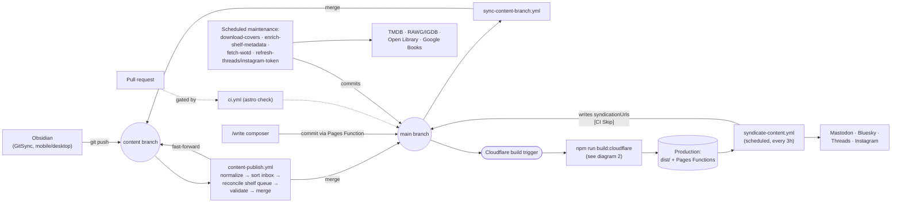
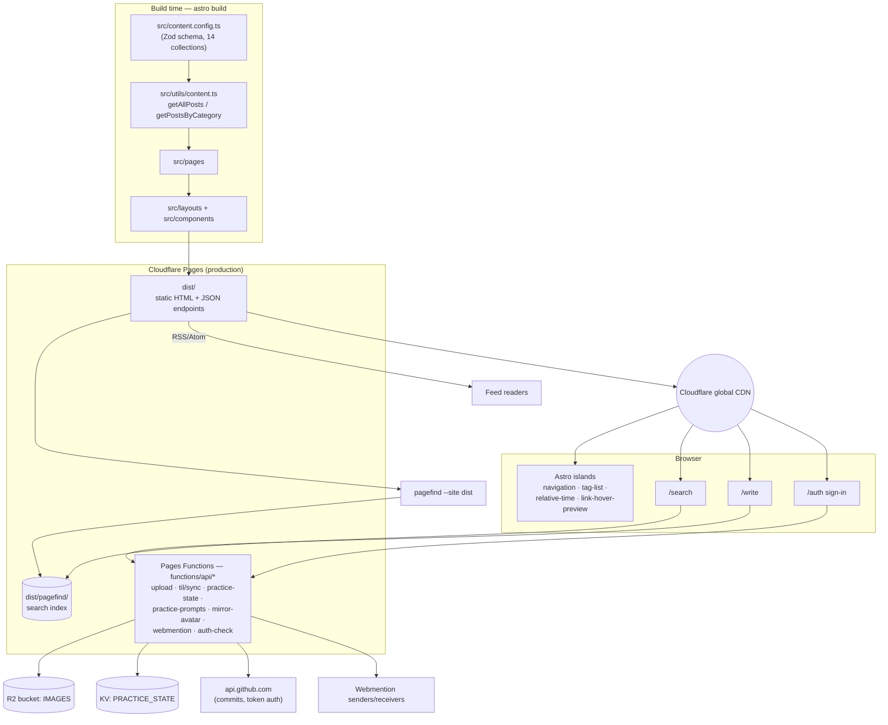

# Component Diagram

Two Mermaid diagrams that map how content and code move through this
project: how a post gets from a note to production, and how the pieces at
runtime talk to each other. Pair these with the prose in
[Architecture Overview](overview.md) and [Content Lifecycle](content-lifecycle.md).

## 1. Publishing & deploy pipeline

How a note (or a code change) travels from its source to production, and
what happens on a schedule afterward.

Notes:

- `content-publish.yml` is the only path from `content` into `main`; a
  missing/unknown `category` fails the run and opens an issue instead of
  reaching production. See [Publishing Pipeline](../content/publishing-pipeline.md).
- The `/write` composer bypasses `content` entirely — it commits
  schema-valid files straight to `main` through a Pages Function for
  instant publishing.
- Syndication is decoupled from the build: it runs on a 3-hour schedule,
  not per push, and its bookkeeping commit is tagged `[CI Skip]` so it
  never triggers a second Cloudflare build.

## 2. Runtime component architecture

What actually renders a page and serves a request once code reaches
Cloudflare — from content collections at build time, to islands and
Pages Functions at request time.

Notes:

- Everything dynamic — image uploads, TIL sync, spaced-repetition state,
  avatar mirroring, incoming webmentions, and the GitHub-token auth check —
  runs as a Cloudflare Pages Function, not client-side JavaScript.
- Client islands are opt-in per page (passed as flags to `Layout.astro`),
  so most routes ship no extra JS beyond the shared shell.
- Search never touches `getAllPosts()` at request time: Pagefind indexes
  the already-built HTML, and `/search` lazy-loads that static index.

## Related guides

- [Architecture Overview](overview.md)
- [Content Lifecycle](content-lifecycle.md)
- [Publishing Pipeline](../content/publishing-pipeline.md)
- [Deployment](../operations/deployment.md)
- [Syndication](../operations/syndication.md)
