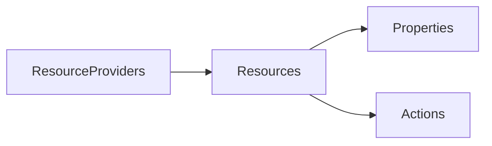

# Resource structure

- Azure Resource Manager (ARM) replaced Azure Service Manager
- ARM Resource providers have n number of resources under them
- Resources have properties and actions
- Querying ARM can be slow and expensive. There is a quota. So we use [[202406151133 Azure Resource Graph|Azure Resource Graph]]
- 1 [[202404061212 Azure Resources|resource]] can be a member of only 1 [[202404051818 Resource Groups|RG]]
- 1 [[202404061212 Azure Resources|resource]] and [[202404051818 Resource Groups|resource groups]] is tagged to a single [[202401101441 Azure subscriptions|subscription]]
- 

---
# references: