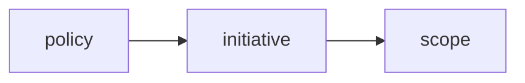

Part of [[202404051739 Governance Overview|azure governance]]

1. Sits at top of ARM and any [[202404061358 CRUD|CRUD]] operations have to go through it
2. Can be used for enforcement and audit
3. Start with audit (to figure out how things are being used)
	1. then later you can move to enforcement
4. Uses json format to form the logic
5. Can create a compliance report
6. Historically focused around resource
	1. Recently focusing on actions (DenyActions, e.g. Delete) that one can take on resources
7. Does not apply to existing [[202404061212 Azure Resources|resources]] (need to update resource)

# How

1. Policy is business rules defined in json
2. Set of policies can be grouped into an initiative
3. which is then assigned to a scope ([[202401101441 Azure subscriptions|subscription]],[[202404051818 Resource Groups|resource groups]],[[202404051803 Management groups|management group]] or [[202404061212 Azure Resources|resources]])
# Example Policy Definition

```json
{
  "properties": {
    "displayName": "Allowed locations",
    "description": "This policy enables you to restrict the locations your organization can specify when deploying resources.",
    "mode": "Indexed",
    "metadata": {
      "version": "1.0.0",
      "category": "Locations"
    },
    "parameters": {
      "allowedLocations": {
        "type": "array",
        "metadata": {
          "description": "The list of locations that can be specified when deploying resources",
          "strongType": "location",
          "displayName": "Allowed locations"
        },
        "defaultValue": [
          "westus2"
        ]
      }
    },
    "policyRule": {
      "if": {
        "not": {
          "field": "location",
          "in": "[parameters('allowedLocations')]"
        }
      },
      "then": {
        "effect": "deny"
      }
    }
  }
}
```

---
# references:
[Azure Policy](https://learn.microsoft.com/en-us/azure/governance/policy/overview)
[Azure Policy JSON reference](https://learn.microsoft.com/en-us/azure/governance/policy/concepts/definition-structure-basics)
