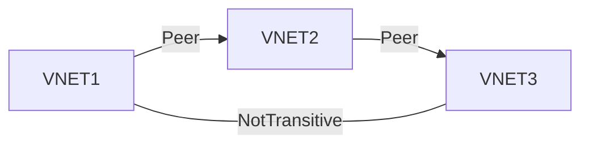
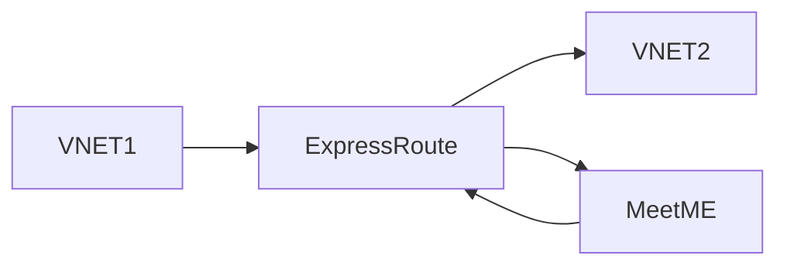
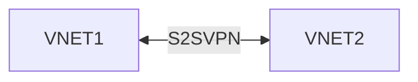

- If you wish to have multiple subscriptions and/or use multiple regions you will have multiple virtual networks
- In the past we could connect virtual networks using S25 VPN or by connecting to the same ExpressRoute circuit but both approaches have problems
- [[202407151908 VNet Peering|VNet Peering]] enables [[202404121703 Azure VNet|VNets]] to be connected via the Microsoft backbone in the same or different regions (global peering)
- There is a small ingress and egress charge for traffic via network peering
- IP address spaces CANNOT overlap
# [[202407151908 VNet Peering|VNet Peering]]
- Best option
- Can span subscriptions and tenants
- Not transitive i.e. VNET1 can not talk to VNET3 / Need to create peering relationship between them
	- Without peering, I could add Azure Firewall or Network virtual appliance in Hub network (VNET2) and tell:
		- VNET3 if you want to talk to VNET1, next hop is IP of that forwarder
		- VNET1 if you want to talke to VNET3, next hop is IP of that forwarder
	- This above thing is [[202407281401 User defined routing|UDR]]
	- There is also border gateway protocol

# [[202404131337 Connecting to Onprem|Express Route]]
- Bad idea because of latency
- Traffic goes from VNET1 to express route MeetME and then from there to VNET2

# [[202408241251 How to create S2S VPN|S2S VPN]]
- VPN is basically encrypting traffic
- Bad idea because of bad throughput and bandwidth

# Priority
- More specific subnet chosen
	- Between, 10.0.0.0/16 and 10.0.0.0/24, /24 route will be chosen

Between different route types for the same prefix:
1. User-defined routes
2. BGP routes
3. System routes

---
# references:
[ExpressRoute Locations](https://learn.microsoft.com/en-us/azure/expressroute/expressroute-locations)
[MS Learn](https://learn.microsoft.com/en-in/training/modules/control-network-traffic-flow-with-routes/2-azure-virtual-network-route)