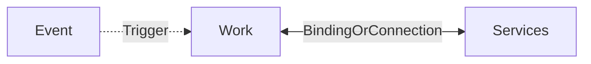

- serverless (can run with [[202404201400 Azure App service#App service plan]])
	- I just write the code
- many languages supported
- Event driven such as HTTP, schedule, event grid, blob creation
- Binds to additional inputs and outputs

# Serverless

- Point of serverless is there is some work you want to do
- Which is triggered by some event (schedule, message, api, etc)
	- Can be many event sources (blob,app,etc) 
	- Which can be difficult to poll, etc.
	- So what we get is Event grid
		- which talks to all these sources and pushes the event to the event handler
		- Event handlers for example [[202404201427 Azure Functions|Azure Functions]], webhooks, etc.
- That work is integrated with services
---
# references: