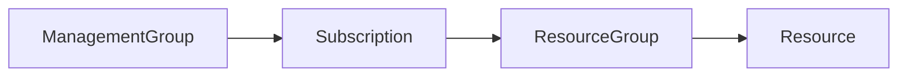

Governance is about a set of rules that need to be followed.
In cloud, the way of doing things is different.
Governance in cloud consists of:
[[202404061356 Azure Policy|policy]] - What can you do?
[[202404061249 Azure RBAC|RBAC]] - Who?
[[202404061425 Azure Cost Management|budget]] - How much?

[[202312231415 Azure Master|"Azure"]] is shared compliance model.

# How to use constructs for governance

The closer you get to the resource, the stricter the policies can be.
At root [[202404051803 Management groups|management group]] level for example, you want broad policies that need to apply. Least restrictive. And so on.

---
# references:
https://www.youtube.com/watch?v=eLSjnF6Crlw&list=PLlVtbbG169nGlGPWs9xaLKT1KfwqREHbs&index=12
[Azure Governance](https://learn.microsoft.com/en-us/azure/governance/)
