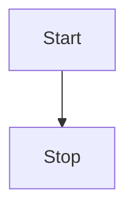

Using mermaid code-block, we can create diagrams.

Example:

Use subgraph to create box.

---
# references:
https://help.obsidian.md/Editing+and+formatting/Advanced+formatting+syntax#Diagram
[Mermaid flowchart reference](https://mermaid.js.org/syntax/flowchart.html)