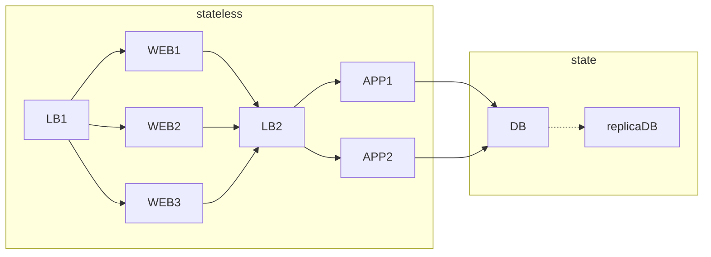

# What are we protecting against
1. Software failure(App/OS,etc) - Replication
2. Hardware failures - Replication
3. Corruption - Backup/Snapshot
4. Attack/DoS - Isolated backups
5. Regulatory requirements - Backup
6. Humans - Processes

# Protection from Infrastructure Failures
1. [[202404071441 Replication|Replication]]
	1. Stateless systems can run from different places, So things like web frontends, etc.
	2. For stateful systems,
		1. async copy to a different region
2. [[202404071559 Azure Backup|Backup]]
	1. Point-in-time copies
	2. For stateful systems, it does not protect against hardware failure as it runs on the same disk. But if there is some logical issue or something, we can revert with this.
3. [[202408041224 Azure Monitoring|Monitoring]]
	1. How are things being used
	2. so that we know when things are not working as they should

# Protection from human errors
1. Little contact with production systems
2. Orchestration tools should be human proof
3. Automated deployments from version control systems. Automated testing. 

# Understand services and dependent services
Basically understand architecture.
1. What are critical services for my business - must protect - where is state? (critical)
	1. stateless things can be recreated 
	2. In example below: state is at DB level. so that is critical. Rest can be recreated.

2. what are the services these critical services depend on - must protect
3. nice to have things
# Understand requirements for availability and architect accordingly
1. Need to architect to meet or exceed agreed SLA
2. Depending on criticality of service you will have certain availability requirement
3. Balancing between price of improving SLA vs cost of downtime
4. For overall SLA is there a **AND** relationship or an **OR** relationship

# Testing
1. Application testing (testing with different types of input data for example)
2. Load testing (testing with number of users)
3. Deployment process testing (How you deploy)
4. Failover testing
5. Restore testing

---
# references:
[John's course](https://www.youtube.com/watch?v=iX87AomIqTw&list=PLlVtbbG169nGlGPWs9xaLKT1KfwqREHbs&index=14)