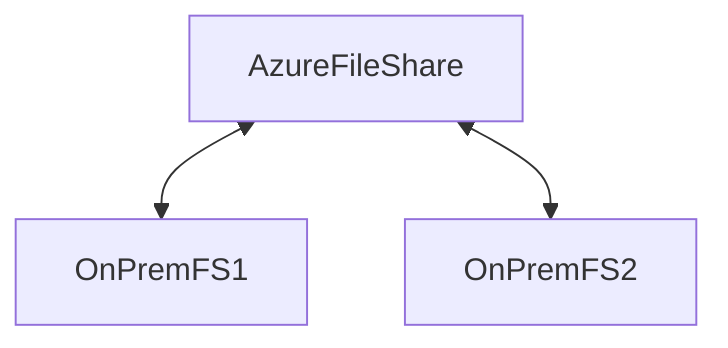

You might have [[202406291221 Azure Files|Azure Files]]
But the on-prem file server might still be there.

It enables:
- Single cloud endpoint per sync group
	- A change detection job is initiated for a cloud endpoint only once every 24 hours
	- On windows server sync is automatic when file is changed
- can not have more than one server endpoint from the same server in the same sync group
- Up to 100 servers per sync group
- Replicates between via the cloud endpoint
- Enables cloud tiering of data off local storage to cloud endpoint to optimize local capacity

You create a sync group in [[202312231415 Azure Master|Azure]] which. allows sync between on-prem and [[202406291221 Azure Files|Azure Files]]

- Does not overwrite any files
- Appends conflict number and keeps both files. 
	- The latest file keeps the original name
- Upto 100 conflicts per file

# Deploy
1. Prepare Windows server
	1. Disable internet enhanced security protection
2. Deploy Storage sync service
3. Deploy Azure File Sync Agent to on-prem server
4. Register on-prem server with storage sync service
5. Create a sync group and a cloud endpoint
6. Create a server endpoint

---
# references:
[MS Learn](https://learn.microsoft.com/en-in/training/modules/configure-azure-files-file-sync/7-deploy-azure-file-sync)
[MS Docs](https://learn.microsoft.com/en-us/azure/storage/file-sync/file-sync-deployment-guide?tabs=azure-portal%2Cproactive-portal)
[Planning for an Azure File Sync deployment](https://learn.microsoft.com/en-us/azure/storage/file-sync/file-sync-planning)
[File sync FAQ](https://learn.microsoft.com/en-us/azure/storage/files/storage-files-faq?toc=%2Fazure%2Fstorage%2Ffilesync%2Ftoc.json#afs-change-detection)
> To immediately sync files that are changed in the Azure file share, the **Invoke-AzStorageSyncChangeDetection** PowerShell cmdlet
