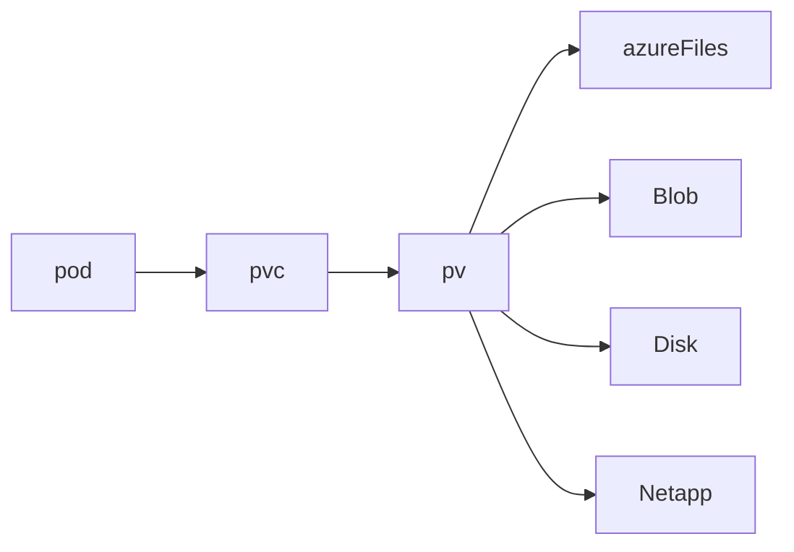

- [[202404201203 Azure Container Instance|Azure Container Instace]] is OK. But mostly we need more than one container. 
- [[202404211433 Kubernetes|Kuberenetes]] is the orchestrator of choice. 
- Two types: free and standard 
	- Standard has SLA / that is what we would use for production
- We pay for the VMs (or nodes) which can auto-scale

# Features
- Can use [[202404201203 Azure Container Instance|ACI]] for cheap via virtual kubelet // need to specify in our manifest file
- Stop/start aks cluster
- Automatic healing
- Automatic upgrade
	- Not to be used in prod as it might break things
- Gitops 
	- Make changes to your repo, that gets deployed to AKS
- Managed ID use
	- Create a user [[202312231441 Entra ID Managed Identities|MI]]
	- Tag that to a service account created in AKS
	- Then stuff happens and we can use IDs
- User node pools can use spot instances
# Structure
- When we run commands (kubectl) it talks to API server. Other [[Kubernetes Components]] like etcd (DB), scheduler, etc talk to API server. All this is control plane.
- Then we have node pools, where basically the worker nodes run.
	- There is type system which basically has things that [[Kubernetes]] needs to run.
	- In node pools we have nodes. 
		- On each node we have [[Kubernetes Components]] like kubelet (which talks to api server for management), kubeproxy (for network stuff) and container runtime.
		- Additionally, then we have our pods. Which are you know our services.
- Namespaces allow for isolation.

# Autoscaling
## For pod scaling
1. Horizontal pod auto-scaling
	1. If it sees it needs more pods it will autoscale.
2. Kubernetes Event driven autoscaling (KEDA)
	1. It will look at advanced metrics (queue, etc) to see if it needs more pods and then autoscale
But, if after seeing that it needs more pods, and it is not able to scale then it goes for 
## Cluster scaling
Basically, if pod is in waiting state, it will autoscale to add a node.

# Networking
Max pods can be set as high as 250 at deployment time, otherwise you get defaults per below.
## kubenet (default) (basic) Not for production
- Nodes get IP from subnet
- internal IP space for pods (NAT so that they can reach external resources/vice-versa)
- Max 110 pods per node (default)
## Azure CNI (advanced)
- pods get ips from the same subnet
- needs to be planned in advance
- 30 (default)/ 110 from portal (default)

### Dynamic CNI
- Pod IPs from a different subnet

## CNI overlay
Like kubenet, gets IPs from a different private subnet (which can be reused in a different cluster)

# Storage
Containers can be created/re-created whenever.
But there is a need for persistent storage.
So pod makes a persistent volume claim (pvc) which goes to a persisten volume (pv) which can be on blob, disk, files, netapp, etc.

---
# references:
[Core concepts](https://learn.microsoft.com/en-in/azure/aks/concepts-clusters-workloads)
[Network concepts](https://learn.microsoft.com/en-in/azure/aks/concepts-network)
