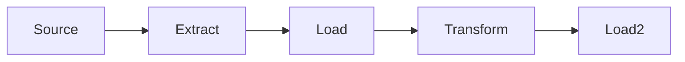

- Data flows in [[202404271503 Extract Transform Load|ETL]] or [[202404271503 Extract Transform Load|ELT]] form.
- Azure Data factory is a solution to give this control

# Data source
Data source is either in:
1. Batch
	1. Data is gathered somewhere and then processed in one go.
	2. Interval processing
	3. Large volume of data
	4. Some latency will be there
2. Serial
	1. Data keeps coming. We process it as it arrives
	2. We will usually have some hub which collects it and then passes it along. like IoT hub, etc.
	3. Low latency
# ETL
- Extract Transform Load
- ETL used to be in earlier days when storage was costlier
- So we would transform the data and then go to load stage
- Transform is either 
	- Mapping
	- Wrangling
	- Complex (HD insights, etc)
- Load is stored in DB, or [[202404261931 Azure Data warehouse and analytics]] 
- And then finally analyze phase

# ELT
- Storage is cheap now.
- So we store it in something like [[202404121149 Azure Data Lake]] 
- The benefit is that in future we may want to transform it in some new way
	- But if we transform like in ETL then that data is lost and we can't do anything
	- Now we have loaded it in [[202404121149 Azure Data Lake]] so we can use it later as needed

---
# references: