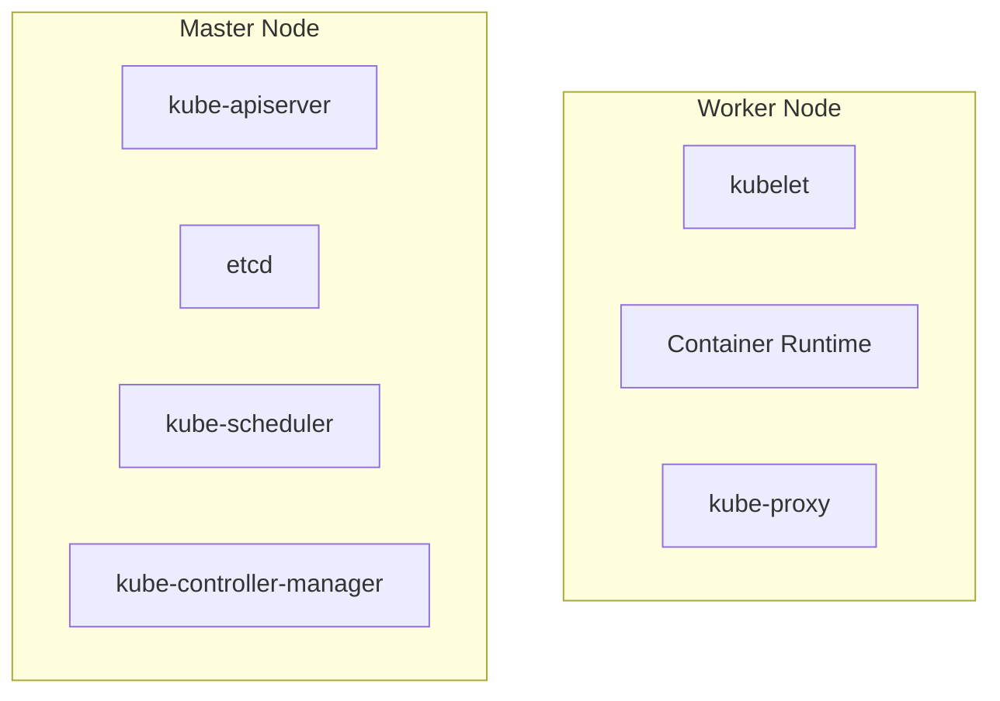

When you deploy a Kubernetes cluster, what you are deploying are nodes, which run the containerised applications.

Each cluster has two types of nodes:
1. **Master node(s)** host the *Kubernetes Control Plane* that controls and manages the whole Kubernetes system
2. **Worker node(s)** host the pods which are the components of the application.

# Kubernetes Control Plane
The Control Plane controls the cluster and makes it function.
It has the following components:
1. **kube-apiserver** which you and the other Control Plane components communicate with
2. **etcd** a reliable distributed data store that persistently stores the cluster configuration.
3. **kube-scheduler** watches for newly created [Pods](https://kubernetes.io/docs/concepts/workloads/pods/) with no assigned [node](https://kubernetes.io/docs/concepts/architecture/nodes/), and selects a node for them to run on.
4. **kube-controller-manager** which performs cluster-level functions, such as replicating components, keeping track of worker nodes, handling node failures, and so on

# Node Components
1. **kubelet** an agent, which runs on each node in the cluster and talks to the API server and manages containers on its node
2. **kube-proxy** which load-balances network traffic between application components
3. **Container runtime** : docker, rkt, etc.
