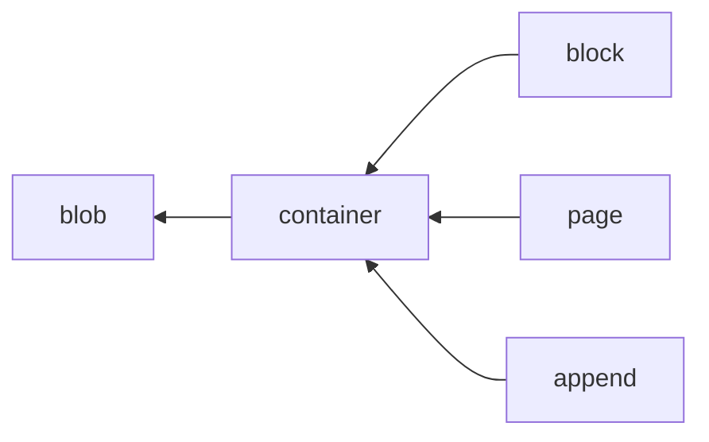
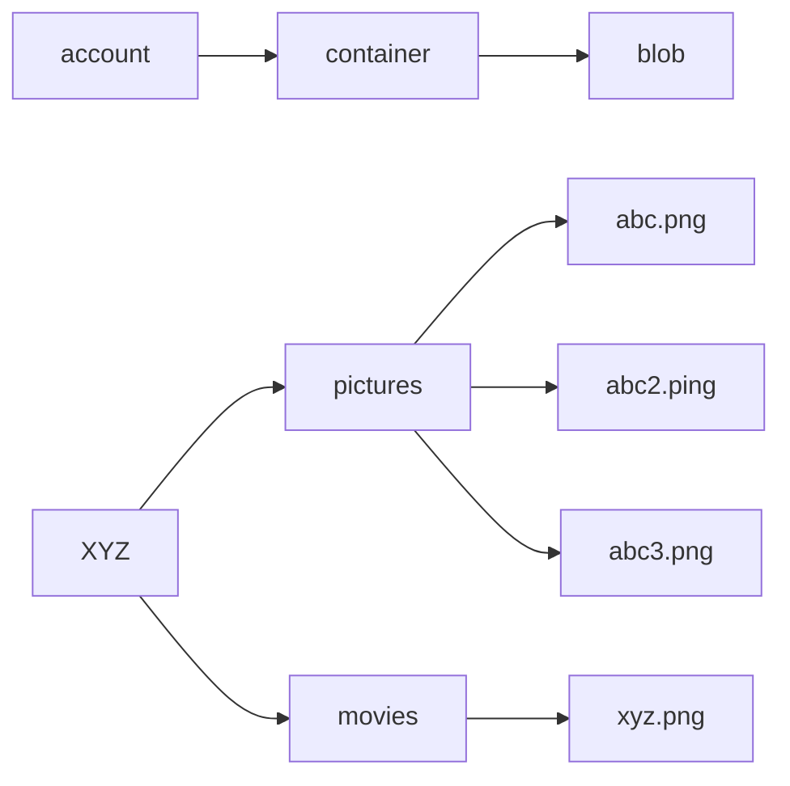
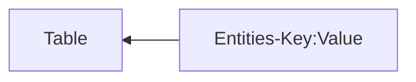
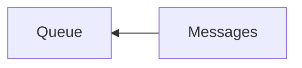
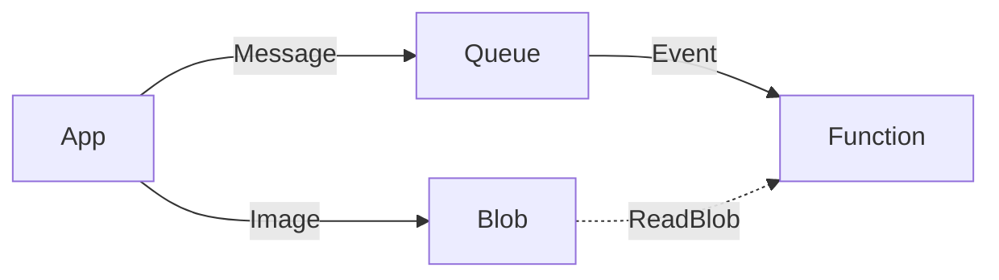
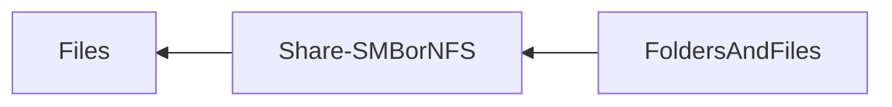

---
aliases:
  - Azure Storage Services
  - Azure storage service
tags:
  - "#azure"
  - "#storage"
category: til
updated: 2026-08-25T14:30:56
---
Extension of [[202404091847 Azure Storage Overview]]
Related to [[202404091859 Azure Storage Account]]

1. Blob
2. FileShares
3. Queues
4. Table
5. Disks
# Blob
We have:
- Blob Indexes for [[202404051739 Governance Overview|azure governance]]
- Blob inventory 
	- Go over what all you have

Uses 3 things to store stuff:
1. Storage account
2. Containers in storage account\
3. Blobs

## Types

- Block (ADLSGen2 (hierarchical namespace)(NFS/SFTP))
	- By default these are flat (might show folders etc, but are not actually folders)/ but we can enable hierarchical namespace
- Page (Random - For OS/VM data disks,etc.)
- Append (for logs)

# Table

# Queue

- Used for some event driven things.
	Like: App writes to blob. It also puts a message in queue. A function reads the message in queue, then reads from the blob and does whatever

- Not guaranteed fifo
# Files

---
# references: