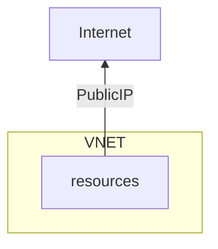

---
aliases:
  - External Access
tags:
  - "#azure"
  - "#network"
category: til
updated: 2026-08-25T14:30:56
---
- There is no special "DMZ" subnet where resources get a public IP
- By default Azure provides outbound SNAT/PAT enabling resources to access the Internet and receive responses
- To provide services to the Internet either
	- Give the IP configuration an instance level public IP (not a good idea)
	- Place the instances behind an [[202407271319 Azure Load Balancer|Azure Load Balancer]], [[202407271353 Azure Application Gateway|Azure Application Gateway]] or [[202407281410 Network Virtual Appliance|NVA]] which has a [[202407271143 Public IP address allows inbound access based on tier in Azure|Public IP Address]] in the front-end configuration
	- Use a network virtual appliance with a public IP
- Care should be taken to only expose the ports required, e.g. 443
- DO NOT enable SSH/RDP to internet

# SNAT // Outbound
- Source Network Address Translation
- Internal IPs can not be used to talk to Internet
- So, we basically have a public IP for resources and a range of ports (max 1024 ports)
- SNAT can say for this port using the public IP resource 1 talk to internet
- For this other port using the same public IP resource 2 talk to internet and so on

## Connectivity Methods
### Implicit
- When a VM is created it gets a public IP for default internet access
- IP not fixed
- Not recommended/not so secure

### Explicit

| #   | Method                                                                             | Type of port allocation | Production-grade?     | Rating |
| --- | ---------------------------------------------------------------------------------- | ----------------------- | --------------------- | ------ |
| 1   | Use the frontend IP address(es) of a load balancer for outbound via outbound rules | Static, explicit        | Yes, but not at scale | OK     |
| 2   | Associate a NAT gateway to the subnet                                              | Dynamic, explicit       | Yes                   | Best   |
| 3   | Assign a public IP to the virtual machine (Don't want to use this)                 | Static, explicit        | Yes                   | OK     |

# NAT // Inbound
- used to forward traffic from a load balancer frontend to one or more instances in the backend pool.
- Don't use direct public IP to instance
## Regional
- L4 - [[202407271319 Azure Load Balancer|Azure Load Balancer]] (TCP/UDP)
- L7 - [[202407271353 Azure Application Gateway|Azure Application Gateway]] (HTTP/HTTPS/HTTPS2)
## Global
- L7 - Front Door
- L4 - Global LB, Traffic Manager - DNS based

---
# references:
https://learn.microsoft.com/en-us/azure/load-balancer/load-balancer-outbound-connections
[Default Outbound access in azure](https://learn.microsoft.com/en-us/azure/virtual-network/ip-services/default-outbound-access)
[Inbound NAT rules](https://learn.microsoft.com/en-us/azure/load-balancer/inbound-nat-rules)

