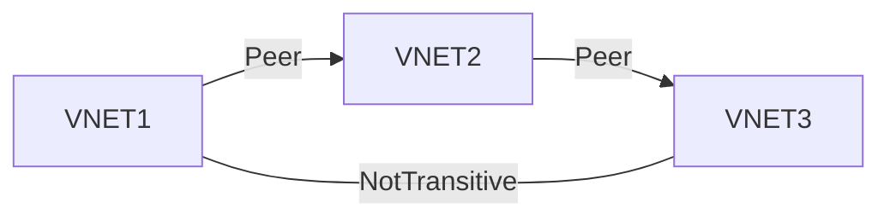

---
aliases:
  - VNet Peering
tags:
  - "#azure"
  - "#network"
category: til
updated: 2026-08-25T14:30:56
---
- One of the options for [[202404131313 Connecting virtual networks|Connecting virtual networks]] / the best option
- Peered traffic goes on Azure Backbone network and is private
- When Networks are peered, we can use [[202407151913 Azure VPN|Azure VPN Gateway]] in the peered network for [[202404131337 Connecting to Onprem|Connecting to Onprem]]
	- Gateway transit makes it so, that I don't have to setup a [[202407151913 Azure VPN|Azure VPN Gateway]] in the peer [[202404121703 Azure VNet|VNet]]
- [[202407151943 Create VNet Peering in Azure|Create VNet Peering in Azure]]
	- When creating [[202407151908 VNet Peering|VNet Peering]] with az cli or [[202207181612 Powershell|Powershell]] only one side of peering gets created. We need to create both sides.
- Typical topology is hub and spoke
	- VNET2 below is hub
	- Typically you will put the [[202407151913 Azure VPN|Azure VPN Gateway]] in this hub network and let other networks use it. Same for other things like NVAs
- Not transitive i.e. VNET1 can not talk to VNET3 / Need to create peering relationship between them
	- Without peering, I could add Azure Firewall or Network virtual appliance in Hub network (VNET2) and tell:
		- VNET3 if you want to talk to VNET1, next hop is IP of that forwarder
		- VNET1 if you want to talke to VNET3, next hop is IP of that forwarder
	- This above thing is UDR (User defined routing)
- If we add a new ip address space to one vnet, we just need to sync peering not re-create peering or anything

# Types
- global ([[202404121703 Azure VNet|VNet]] in different regions)
- regional ([[202404121703 Azure VNet|VNet]] in same region)

---
# references:
[MS Learn](https://learn.microsoft.com/en-in/training/modules/integrate-vnets-with-vnet-peering/2-connect-services-using-vnet-peering)
> To enable gateway transit, configure the **Allow gateway transit** option in the hub virtual network where you deployed the gateway connection to your on-premises network. Also configure the **Use remote gateways** option in any spoke virtual networks.